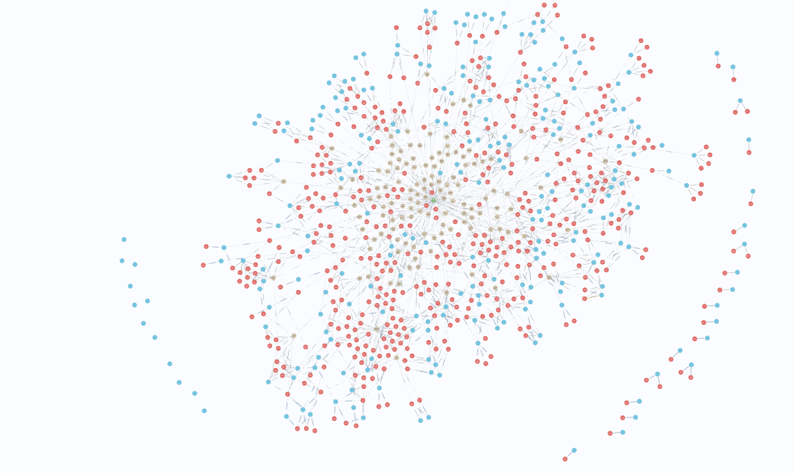

# ESG Relevance Extraction Toolkit

This toolkit helps extract and evaluate **company measures** against sustainability **disclosure requirements** from ESG reports using a combination of NLP, LLMs, and semantic search methods.

---

## 1. `cosine_similarity copy.py`

### Purpose
Automatically **match ESG disclosure requirements** to relevant text snippets from an ESG report PDF using a hybrid retrieval pipeline:
- Sparse BM25
- Dense Sentence-BERT
- Cross-Encoder reranking
- Fuzzy and TF-IDF fallback

### Input
- A CSV or Excel file containing disclosure requirements with columns like:
  - `Disclosure No.`
  - `Requirement`
  - *(Optional)* `Sub` (additional info)
- An ESG report in PDF format

### Output
- An Excel file listing the **top-k matched sentences** for each requirement:
  - `match_1`, `match_2`, ...
  - `score_1`, `score_2`, ...

### Models Used
- `sentence-transformers` bi-encoder (default: `./models/esg-finetuned`)
- `cross-encoder/ms-marco-MiniLM-L-6-v2` for reranking

### How to Run

```bash
python "cosine_similarity copy.py"
```

You’ll be prompted for:
- Disclosure input file
- ESG PDF file
- Number of top-k results
- Output file name

---

## 2. `relevancy_checker.py`

### Purpose
Given a spreadsheet of candidate matches from the previous script, this script:
1. Uses an LLM (Groq API) to rate relevance of matches
2. Picks the best one with score > 2
3. Locates the source page in the ESG report
4. Extracts the **most relevant sentence**
5. Outputs results to Excel

### Input
- An Excel file with columns:  
  - `disclosure_id`, `requirement`, `match_1`, `match_2`, `match_3`
- The same ESG report PDF used previously

### Output
An Excel file with:
- `Disclosure No.`
- `Requirement`
- `Used Match`
- `Extracted Sentence`
- `Relevance (1–5)`
- `Pages Found`

### API Dependency
Requires a **Groq API key** set as `GROQ_API_KEY` in `.env`.

### How to Run

```bash
python relevancy_checker.py
```

You’ll be prompted to input:
- Path to the Excel file with match candidates
- Path to the ESG report PDF
- (Optional) Output filename

---

## Dependencies

Install via pip:

```bash
pip install -r requirements.txt
```

Key packages:
- `fitz` (PyMuPDF)
- `pandas`, `numpy`, `scikit-learn`
- `spacy`, `sentence-transformers`, `rank_bm25`, `fuzzywuzzy`
- `requests`, `dotenv`

---

## Recommended Workflow

1. **Initial Matching**  
   Run `cosine_similarity copy.py` to find top-5 matches for each requirement.

2. **Relevance Evaluation + Sentence Extraction**  
   Use `relevancy_checker.py` to filter, score, and extract precise answers.

3. **Graph Ingestion (Optional)**  
   Use final output to populate a Neo4j ESG graph or embed into a vector index.

## Neo4j Graph Visualization

An example of the ESG knowledge graph in Neo4j is contained in the `neo4j` folder, showing how **Disclosure**, **Requirement**, **Measure**, and **Company** nodes are interconnected. Red nodes represent measures, blue nodes represent disclosures, and yellow nodes represent requirements.



Nodes and relationships can be explored in the Neo4j Browser or Data Importer:

```
MATCH (d:Disclosure)-[:HAS_REQUIREMENT]->(r:Requirement)
MATCH (r)-[:ADDRESSED_BY]->(m:Measure)
MATCH (m)-[:PROVIDED_BY]->(c:Company)
RETURN d, r, m, c
```

This graph is also vectorized for semantic search using the Neo4j vector plugin (Enterprise edition 5.11+).
